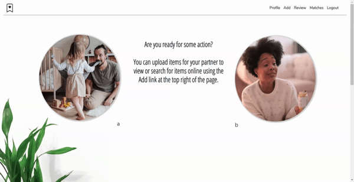
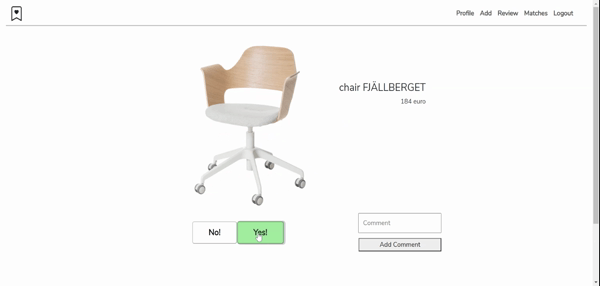

# KOTI shopping assistant
 
It's an application for those who like to decide on their shopping list together.
 
The first registered user shares his randomly generated code for his partners registration. After they team up,
users may add their desired items to a Review list (filling the form manually or searching for items online).
 
 

 
 
 
Added item enters the Matches list only after both users say "yes" going through their Review list.
 
Users may also add comments when reviewing.
 
 
 

 
 
Final shopping list shows comments for the individual items
 
and the final price of the shopping list.
 
 
 

 
 
# Development  
React  
JavaScript   
Node.js   
Postgresql   
Express.js   
CSS 
